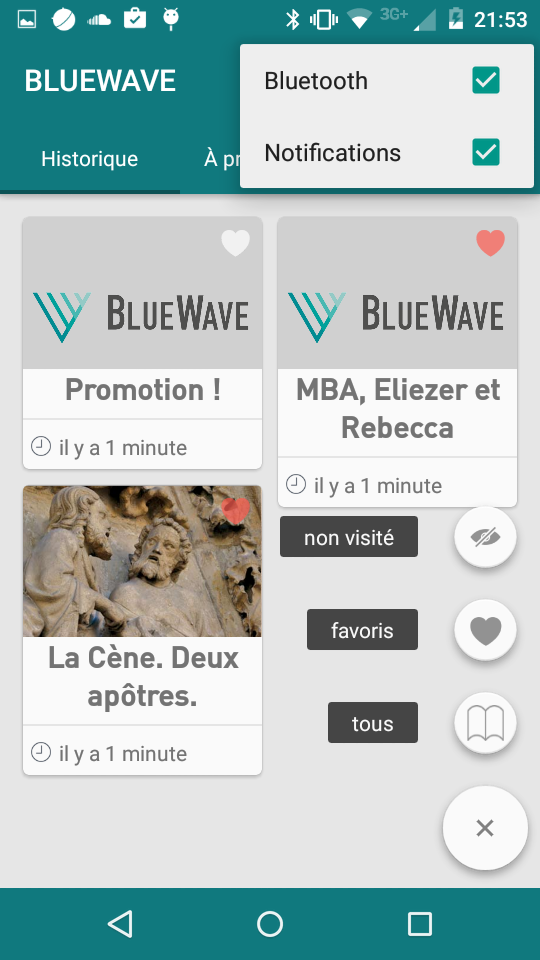
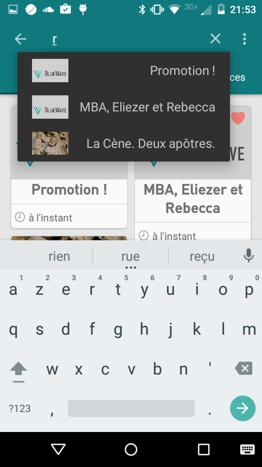
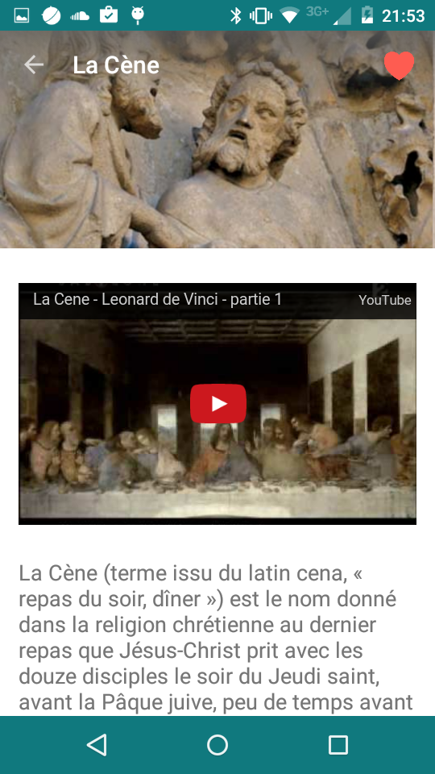
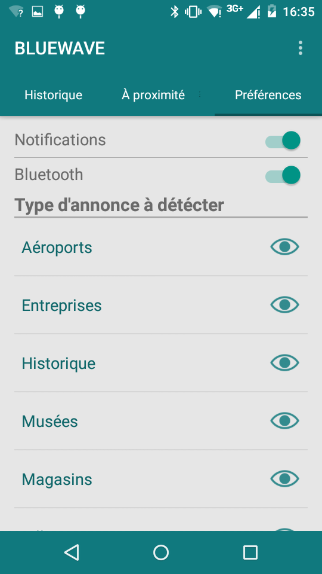

BlueWave-Android
================

##[BlueWave iOS link](http://github.com/juliengenoud/bluewave-ios)

Cette application a pour but de promouvoir et/ou présenter un produit à courte proximité à l'aide de la nouvelle technologie Bluetooth Low Energy, des balises bluetooth (http://store.gimbal.com/collections/beacons/products/s10) et de la librairie Altbeacon (https://github.com/AltBeacon/android-beacon-library).

Un BackEnd web a été développé en parallèle permettant aux professionnels de configurer leurs balises.
Application principalement dédiée aux commerçants, aux musées mais aussi
au service public.

Page de présentation : http://notiwave.com

Vidéo de présentation : http://www.youtube.com/watch?v=Bt5OSYRqDeQ

Screenshots :

